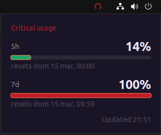

# Claude Usage Indicator

A lightweight system tray application for Linux (Ubuntu/GNOME) that displays real-time Claude API usage and token utilization.

## Features

*   **Linux Desktop Native:** Specifically designed for Linux environments with GTK 3 support.
*   **Real-time Monitoring:** Displays Claude API usage for both 5-hour and 7-day windows.
*   **System Tray Integration:** Circular progress icons that change color based on usage levels (OK, Warning, Critical).
*   **Detailed Popup:** Click the tray icon to see exact percentages and reset times.
*   **Low Resource Usage:** Written in Python using GTK 3 and Cairo for efficient rendering.
*   **Autostart:** Simple installation script to ensure the indicator starts with your session.

## Screenshots



## Prerequisites

The application requires Python 3 and GTK 3 introspection libraries. On Ubuntu/Debian, install them using:

```bash
sudo apt update
sudo apt install python3-gi gir1.2-gtk-3.0 python3-cairo gir1.2-appindicator3-0.1
```

## Configuration

The application reads your Claude API credentials from a JSON file located at `~/.claude/.credentials.json`. 

Ensure the file exists with the following structure:

```json
{
  "claudeAiOauth": {
    "accessToken": "YOUR_ACCESS_TOKEN",
    "expiresAt": 1741910400000
  }
}
```

*Note: `expiresAt` is optional but recommended for token validity checks (timestamp in milliseconds).*

## Installation

1.  **Clone the repository:**
    ```bash
    git clone https://github.com/yourusername/claude-usage-indicator.git
    cd claude-usage-indicator
    ```

2.  **Run the installation script:**
    This script sets up the autostart entry in `~/.config/autostart/`.
    ```bash
    chmod +x install.sh
    ./install.sh
    ```

## Usage

### Starting Manually
If you want to run it without restarting your session:
```bash
python3 claude_usage_indicator.py &
```

### Automatic Start
After running `./install.sh`, the application will start automatically every time you log in to your desktop environment.

### Checking Logs
Logs are stored in the `logs/` directory. The active log file is always `indicator.log`.

At midnight, the application automatically rotates the log file, renaming it to the date it represents (e.g., `2026-03-14.log`) and starting a fresh `indicator.log`.

To monitor real-time activity:
```bash
tail -f logs/indicator.log
```

## Project Structure

*   `claude_usage_indicator.py`: Main entry point.
*   `indicator/`: Core logic package.
    *   `api.py`: Handles OAuth and API requests.
    *   `icons.py`: Dynamic icon generation using Cairo.
    *   `tray.py`: System tray (AppIndicator) implementation.
    *   `window.py`: Detailed usage popup window.
    *   `theme.py`: UI colors and thresholds.
    *   `config.py`: Path and interval configurations.
*   `assets/`: Storage for generated tray icons.
*   `install.sh`: Setup script for Linux autostart.

## License

[MIT License](LICENSE) (or specify your license)
