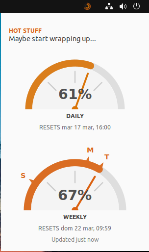
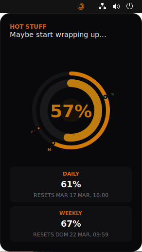
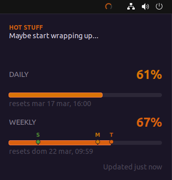

# Claude Usage Watcher

A lightweight system tray application for Linux (Ubuntu/GNOME) that displays real-time Claude API usage and token utilization.

| Desktop | Obsidian | Classic |
|---------|----------|---------|
|  |  |  |

## Features

- **Two themes:** Obsidian (animated concentric rings with glow) and Classic (progress bars). Switch between them via the right-click context menu — preference is saved across sessions.
- **EN/ES & Style support:** Switch between English/Español and "Serious"/"Funny" text styles via the right-click context menu. All visible text updates immediately — menu labels, tooltips, popup window, and notifications.
- **Real-time monitoring:** Displays Claude API usage for both the 5-hour and 7-day windows.
- **Progressive colors:** Tray icon and popup colors interpolate continuously from green (0%) → amber (70%) → red (95%) → purple (100%).
- **Dynamic tray icon:** Concentric arcs rendered in memory via Cairo — no disk I/O at runtime.
- **Desktop notifications:** Alerts when usage crosses tier thresholds.
- **Resource efficient:** Pure Python using only stdlib, GTK 3 bindings, and pycairo.

## Prerequisites

Requires Python 3 and GTK 3 introspection libraries. On Ubuntu/Debian:

```bash
sudo apt install python3-gi gir1.2-gtk-3.0 python3-cairo gir1.2-appindicator3-0.1
```

## Configuration

The application reads your Claude credentials from `~/.claude/.credentials.json`:

```json
{
  "claudeAiOauth": {
    "accessToken": "YOUR_ACCESS_TOKEN",
    "expiresAt": 1741910400000
  }
}
```

`expiresAt` is optional but recommended for token validity checks (timestamp in milliseconds).

## Installation

1. **Clone the repository:**
   ```bash
   git clone https://github.com/yourusername/claude-usage-watcher.git
   cd claude-usage-watcher
   ```

2. **Run the installation script:**
   ```bash
   chmod +x install.sh
   ./install.sh
   ```

   This installs the Python package and creates an autostart entry in `~/.config/autostart/` so the app launches automatically on login.

## Usage

### Running manually

```bash
python3 claude_usage_watcher.py &
```

Or, if installed via pip:

```bash
claude-usage-watcher &
```

### Tray interaction

- **Left-click** the tray icon to open the usage popup.
- **Right-click** to open the context menu (refresh, switch language, switch style, switch theme, quit).
- **Dark Theme:** Menus are forced to a dark theme for visual consistency across desktop environments.

### Logs

```bash
tail -f ~/.local/share/claude-usage-watcher/logs/watcher.log
```

Daily rotation at midnight, 30-day retention.

## Project structure

```
claude-usage-watcher/
├── claude_usage_watcher.py   ← entry point
├── install.sh
└── watcher/
    ├── config.py               ← paths, constants, settings, shared logger
    ├── i18n.py                 ← translation engine with EN/ES and style support
    ├── history.py              ← logs-to-history extraction and usage persistence
    ├── theme.py                ← tier thresholds, colors, CSS helpers, menu theme
    ├── icons.py                ← Cairo rendering (tray icon + gauge)
    ├── api.py                  ← token reading, API fetch, time formatting
    ├── window.py               ← popup UI (ObsidianWindow, ClassicWindow)
    ├── tray.py                 ← ClaudeWatcher (tray icon + polling)
    └── windows/                ← specialized UI designs (Obsidian, Classic, Desktop)
        ├── base.py             ← shared popup logic
        ├── obsidian.py         ← modern concentric rings
        ├── classic.py          ← traditional progress bars
        └── desktop.py          ← fuel-gauge style dashboard
```

## License

This project is licensed under the [MIT License](LICENSE).
