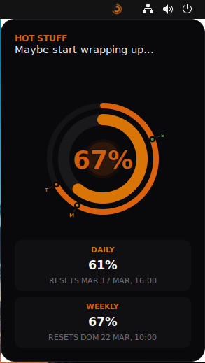

# Claude Usage Watcher

A lightweight system tray application for Linux (Ubuntu/GNOME) that displays real-time Claude API usage and token utilization.

| Desktop | Obsidian | Classic |
|---------|----------|---------|
|  |  |  |

## Features

- **Privacy & Security first:** 100% safe. The application runs entirely on your machine, never asks for your credentials (it reads them from the official `~/.claude/` directory), and only communicates directly with Anthropic's official API. No third-party servers, no data collection.
- **Three distinct themes:** Obsidian (modern concentric rings), Classic (arc progress bars), and Desktop (analog fuel gauges). Switch between them via the right-click menu — your preference is saved.
- **EN/ES & Style support:** Switch between English/Español and "Serious"/"Funny" text styles. All UI elements update instantly.
- **Real-time monitoring:** Displays Claude API usage for both the 5-hour and 7-day windows.
- **Progressive colors:** Tray icon and popup colors interpolate continuously from green (0%) → amber (70%) → red (95%) → purple (100%).
- **Dynamic tray icon:** Concentric arcs rendered via Cairo, updated through AppIndicator3.
- **Desktop notifications:** Alerts when usage crosses tier thresholds.
- **Resource efficient:** Pure Python using only stdlib, GTK 3 bindings, and pycairo.

## Prerequisites

- **Python 3.7+**
- **Claude CLI** logged in (credentials at `~/.claude/.credentials.json`)
- **Linux** with GTK 3 (Ubuntu/Debian/GNOME)

## Installation

```bash
git clone https://github.com/janotherdev/claude-usage-watcher.git
cd claude-usage-watcher
./install.sh
```

The install script:
- Installs system dependencies (`python3-gi`, `python3-gi-cairo`, `python3-cairo`, `gir1.2-gtk-3.0`, `gir1.2-notify-0.7`) if missing
- Installs the package via `pipx` (isolated env with access to system GTK bindings)
- Generates the initial tray icon
- Removes any legacy autostart entries
- Creates `~/.config/autostart/com.claudeusage.watcher.desktop` so the app launches automatically on login

To remove autostart:

```bash
claude-usage-watcher --uninstall
```

## Uninstall

```bash
claude-usage-watcher --uninstall   # remove autostart
pipx uninstall claude-usage-watcher # remove the package
```

## Usage

```bash
claude-usage-watcher &
```

- **Click** the tray icon to open the menu. Select **Show Status** to see the usage popup.
- The popup is **draggable** — drag it to your preferred position and it will remember it.
- Use the menu to refresh, switch language, switch style, switch theme, or quit.

### Logs

```bash
tail -f ~/.local/share/claude-usage-watcher/logs/watcher.log
```

Daily rotation at midnight, 30-day retention.

## Project structure

```
claude-usage-watcher/
├── claude_usage_watcher.py   ← legacy entry point (thin wrapper)
├── install.sh                ← full install: apt deps + pipx + autostart
├── pyproject.toml            ← package metadata, entry point: watcher.tray:main
└── watcher/
    ├── __main__.py             ← allows `python -m watcher`
    ├── config.py               ← paths, constants, settings, shared logger
    ├── installer.py            ← --install / --uninstall logic
    ├── i18n.py                 ← translation engine with EN/ES and style support
    ├── history.py              ← logs-to-history extraction and usage persistence
    ├── theme.py                ← tier thresholds, colors, CSS helpers, menu theme
    ├── icons.py                ← Cairo rendering (tray icon + gauge)
    ├── api.py                  ← token reading, API fetch, time formatting
    ├── tray.py                 ← ClaudeWatcher (tray icon + polling)
    └── windows/                ← specialized UI designs
        ├── base.py             ← shared popup logic
        ├── obsidian.py         ← modern concentric rings
        ├── classic.py          ← traditional progress bars
        └── desktop.py          ← fuel-gauge style dashboard
```

## License

This project is licensed under the [MIT License](LICENSE).
