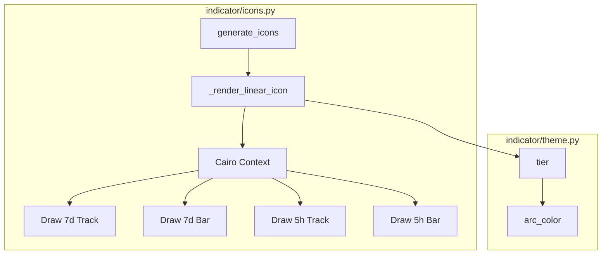

# Implementation Plan — Linear Tray Indicator

> **Feature Name:** Linear Tray Indicator
> **Epic:** UI/UX Tray Experience Refactor
> **Status:** Draft

## 1. Goal

Replace the legacy circular arc icon with a high-density linear indicator. The new design features a dual-bar system: a thick primary bar for 5-hour usage and a thin secondary line for 7-day usage. This maximizes the 22x22px space provided by most Linux system trays (GNOME/Ubuntu), improving legibility and information density.

## 2. Requirements

- **Linear Rendering:** Implement `_render_linear_icon` in `indicator/icons.py` using Cairo.
- **Dual Bars:**
    - Primary bar: 6px height, centered vertically, rounded caps.
    - Secondary bar: 2px height, positioned 2px above the primary bar.
- **Visual Feedback:** 10% opacity background tracks for both bars.
- **Color Logic:** Reuse `tier()` logic from `theme.py` for both bars independently.
- **Static Assets:** Regenerate `icon_ok.png`, `icon_warn.png`, and `icon_crit.png` with representative values (45%, 80%, 95% for 5h; 20%, 50%, 90% for 7d).

## 3. Technical Considerations

### System Architecture Overview

### Implementation Details

#### 1. Update `indicator/icons.py`
- Replace `_render_arc_icon` with `_render_linear_icon(util_5h, util_7d, size=22)`.
- Use `ctx.rectangle` or `ctx.move_to` + `ctx.line_to` with `LINE_CAP_ROUND`.
- Layout:
    - Y-offset for 7d bar: 5px
    - Y-offset for 5h bar: 11px
    - X-padding: 2px (Total width: 18px)

#### 2. Update `indicator/theme.py`
- The `arc_color` function can remain as is, since it provides the RGB tuple needed by Cairo.
- No changes needed to `tier()` or `_ARC_COLORS`.

#### 3. Asset Generation
- Modify `generate_icons()` to pass two utilization values to `_render_linear_icon`.
- Representative pairs:
    - OK: 45% (5h) / 20% (7d)
    - WARN: 80% (5h) / 50% (7d)
    - CRIT: 95% (5h) / 90% (7d)

## 4. Security & Performance

- **Performance:** Cairo rendering is extremely fast for simple shapes. Generating 3 PNGs at startup has negligible impact.
- **Memory:** `io.BytesIO` ensures no temporary files are created except for the final assets.

## 5. Next Steps

1.  **Refactor `indicator/icons.py`:** Implement the new drawing logic.
2.  **Verify Rendering:** Run `python3 claude_usage_indicator.py` and inspect `assets/` files.
3.  **Adjust Layout:** Tweak pixel offsets if the bars feel too crowded or off-center in the tray.
